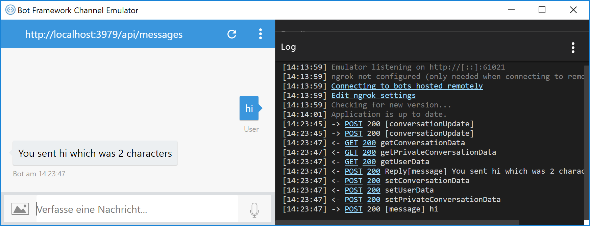

# Microsoft Bot Framework: Tutorial

## Installation
* Das Bot-Framework wird als **NuGet-Package** ausgeliefert
* Für Visual Studio sind **Project Templates** verfügbar:
  * Download unter [Bot Framework SDK and tools](https://docs.microsoft.com/en-us/bot-framework/resources-tools-downloads)
  * ZIP-Dateien kopieren nach _%userprofile%\documents\Visual Studio 2017\Templates\ProjectTemplates\Visual C#_
* Zum Testen ist der **Bot Framework Channel Emulator** praktisch:
  * Download unter [BotFramework-Emulator](https://github.com/Microsoft/BotFramework-Emulator/releases)
  * Setup ausführen

## Neues Projekt
* Erstellen Sie ein neues Projekt mit dem **Bot Application** Template.
* Nennen Sie es **ConferenceBot**


* Updaten Sie ggf. das **Microsoft.Bot.Builder**-NuGet-Package auf die aktuellste Version

## Hello, Bot
Durch das Projekt-Template wird bereits eine minimale Bot-Implementierung bereitgestellt:

Ausschnitt aus *Controllers/MessagesController*
```cs
public async Task<HttpResponseMessage> Post([FromBody]Activity activity)
{
    if (activity.Type == ActivityTypes.Message)
    {
        await Conversation.SendAsync(activity, () => new Dialogs.RootDialog());
    }
    else
    {
        HandleSystemMessage(activity);
    }
    var response = Request.CreateResponse(HttpStatusCode.OK);
    return response;
}
```

Ausschnitt aus *Dialogs/RootDialog*
```cs
[Serializable]
public class RootDialog : IDialog<object>
{
    public Task StartAsync(IDialogContext context)
    {
        context.Wait(MessageReceivedAsync);

        return Task.CompletedTask;
    }

    private async Task MessageReceivedAsync(IDialogContext context, IAwaitable<object> result)
    {
        var activity = await result as Activity;

        // calculate something for us to return
        int length = (activity.Text ?? string.Empty).Length;

        // return our reply to the user
        await context.PostAsync($"You sent {activity.Text} which was {length} characters");

        context.Wait(MessageReceivedAsync);
    }
}
```

### Ausführen des Bots
* Starten Sie die Anwendung
* Kopieren Sie die Adresse (zB http://localhost:3979/)
* Starten Sie den **Bot Framework Channel Emulator**
* Fügen Sie die Adresse inkl. */api/messages* als Endpoint URL ein
* Der Chat kann beginnen!



## FormFlow-Bot
* Erstellen von Model-Klassen (Unterordner */Models*)
```cs
[Serializable]
public class ScheduleQuery
{
    public string Speaker { get; set; }

    public Room? Room { get; set; }

    public string Time { get; set; }
}

public enum Room
{
    Gutenbergsaal1,
    Gutenbergsaal2,
    Gutenbergsaal3,
    Gutenbergsaal4
}
```

### FormFlowConferenceBot

### Version 1
* Erstellen Sie eine Klasse *Dialogs/SimpleConferenceDialog*
* Im einfachsten Fall lassen wir der FormFlow-Engine die gesamte Kontrolle über unseren Bot:

```cs
public class SimpleConferenceDialog
{
    public static IForm<ScheduleQuery> BuildForm()
    {
        return new FormBuilder<ScheduleQuery>()
            .Build();
    }
}
```

Ändern Sie in *Controllers/MessagesController* folgende Zeile:

```cs
if (activity.Type == ActivityTypes.Message)
{
    //old:
    //await Conversation.SendAsync(activity, () => new Dialogs.RootDialog());

    //new:
    await Conversation.SendAsync(activity,
        () => Chain.From(() => FormDialog.FromForm(SimpleConferenceDialog.BuildForm)));
}

```

### Version 2
* Wir können die Reihenfolge und die gestellten Fragen aber auch beeinflussen:

```cs
public class SimpleConferenceDialog
{
    public static IForm<ScheduleQuery> BuildForm()
    {
        return new FormBuilder<ScheduleQuery>()
            .Message("Hi, I need some information from you!")
            .Field(nameof(ScheduleQuery.Time))
            .Field(nameof(ScheduleQuery.Room))
            .OnCompletion(async (context, query) =>
            {
                var typingMessage = context.MakeMessage();
                typingMessage.Type = ActivityTypes.Typing;

                await context.PostAsync(typingMessage);

                await Task.Delay(3000);

                var responseMessage = context.MakeMessage();
                responseMessage.Text = $"In Raum {query.Room} findet ein Lab über das Bot Framework statt.";

                await context.PostAsync(responseMessage);
            })
            .Build();
    }
}
```

Auch mittels Attributen über den einzelnen Properties kann Einfluss genommen werden, zB in *Models/ScheduleQuery*:
```cs
[Prompt("Please enter the begin time of the talk")]
public string Time { get; set; }
```
### Version 3: Hero Cards
Anstatt einer Textnachricht könnte am Schluss auch eine *HeroCard* angezeigt werden.

```cs
var card = new HeroCard()
{
    Title = "Microsoft Bot Framework",
    Subtitle = "Roman Schacherl",
    Text = $"In Raum {query.Room} findet ein Lab über das Bot Framework statt.",
    Images = new List<CardImage>()
    {
        new CardImage()
        {
            Url = "https://api-summit.de/wp-content/uploads/2017/03/API_Summit-3914.jpg",
            Tap = new CardAction(ActionTypes.OpenUrl, "Open", null, "https://www.api-summit.de")
        }
    }
};

responseMessage.Attachments.Add(card.ToAttachment());
```
