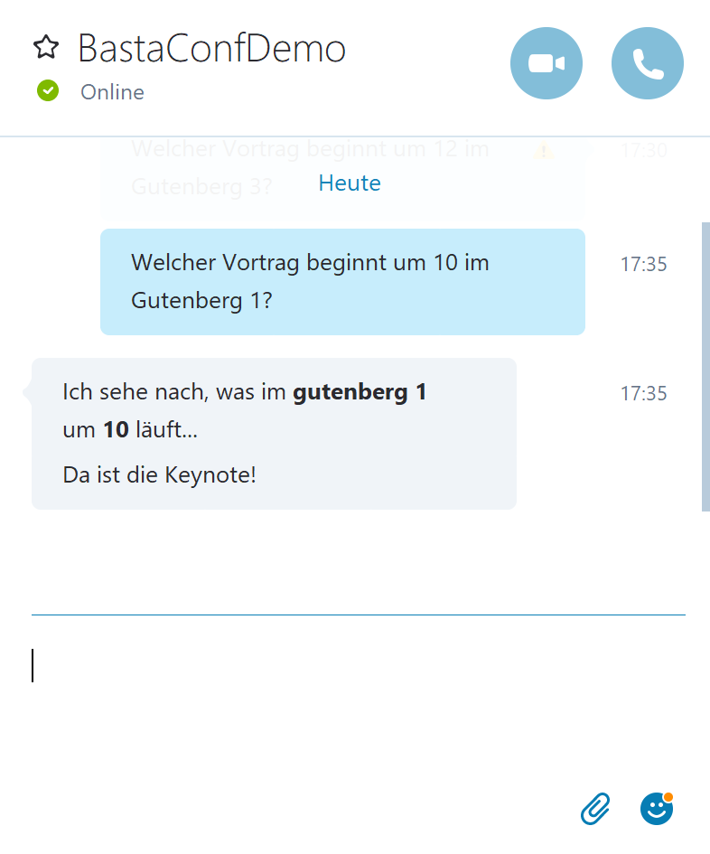
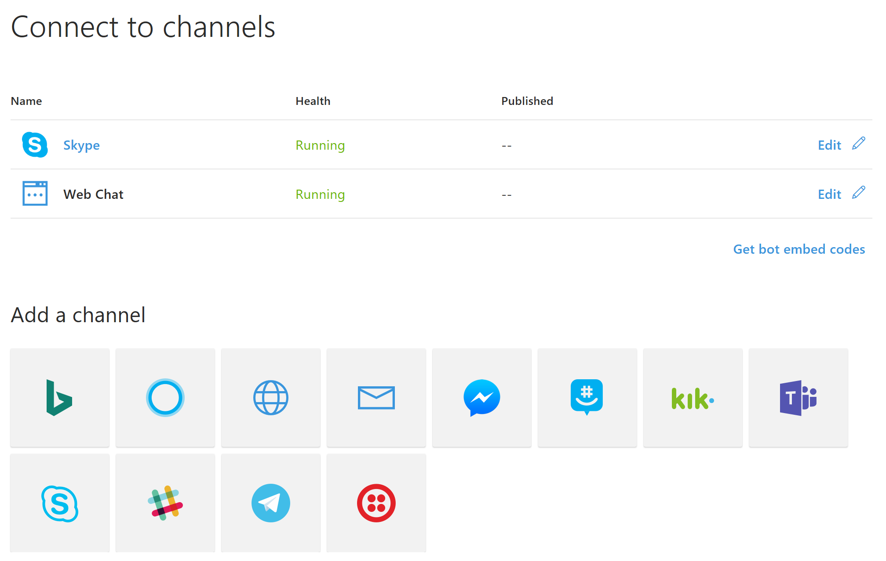

# Channels

Im [Dev-Portal](https://dev.botframework.com) stehen verschiedenste Channel zur Auswahl, mit denen Sie Ihren Bot verbinden können.

## Skype
Skype und Web Chat ist bereits vorselektiert. Beim Klick auf **Skype** können Sie den Bot in ihre Skype-Kontaktliste hinzufügen und zu chatten beginnen.



## Web Chat
Beim Klick auf **Web Chat** erhalten Sie einen fertigen Code zur Einbindung des Controls als iFrame. Sie müssen lediglich den Key im Snippet ersetzen.

```html
<html>
    <head></head>
    <body>

        <iframe src='https://webchat.botframework.com/embed/bastaconfdemo?s=YOUR_SECRET_KEY' height="400">
    </iframe>

    </body>
</html>
```

## Weitere Channels

Experimentieren Sie mit den zusätzlich verfügbaren Channels - die meisten sind relativ einfach zu konfigurieren.

