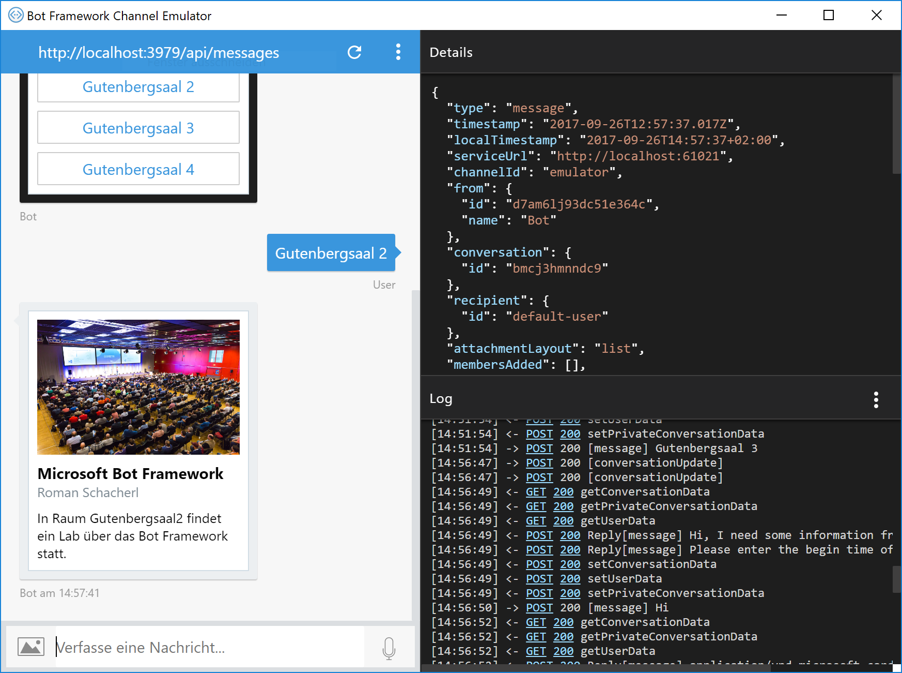

# FormFlow-Bot

## Model-Klassen
* Erstellen von Model-Klassen (Unterordner */Models*)
```cs
[Serializable]
public class ScheduleQuery
{
    public string Speaker { get; set; }

    public Room? Room { get; set; }

    public string Time { get; set; }
}

public enum Room
{
    Gutenbergsaal1,
    Gutenbergsaal2,
    Gutenbergsaal3,
    Gutenbergsaal4
}
```

## Version 1
* Erstellen Sie eine Klasse *Dialogs/SimpleConferenceDialog*
* Im einfachsten Fall lassen wir der FormFlow-Engine die gesamte Kontrolle über unseren Bot:

```cs
public class SimpleConferenceDialog
{
    public static IForm<ScheduleQuery> BuildForm()
    {
        return new FormBuilder<ScheduleQuery>()
            .Build();
    }
}
```

Ändern Sie in *Controllers/MessagesController* folgende Zeile:

```cs
if (activity.Type == ActivityTypes.Message)
{
    //old:
    //await Conversation.SendAsync(activity, () => new Dialogs.RootDialog());

    //new:
    await Conversation.SendAsync(activity,
        () => Chain.From(() => FormDialog.FromForm(SimpleConferenceDialog.BuildForm)));
}

```


## Version 2
* Wir können die Reihenfolge und die gestellten Fragen aber auch beeinflussen:

```cs
public class SimpleConferenceDialog
{
    public static IForm<ScheduleQuery> BuildForm()
    {
        return new FormBuilder<ScheduleQuery>()
            .Message("Hi, I need some information from you!")
            .Field(nameof(ScheduleQuery.Time))
            .Field(nameof(ScheduleQuery.Room))
            .OnCompletion(async (context, query) =>
            {
                var typingMessage = context.MakeMessage();
                typingMessage.Type = ActivityTypes.Typing;

                await context.PostAsync(typingMessage);

                await Task.Delay(3000);

                var responseMessage = context.MakeMessage();
                responseMessage.Text = $"In Raum {query.Room} findet ein Lab über das Bot Framework statt.";

                await context.PostAsync(responseMessage);
            })
            .Build();
    }
}
```

Auch mittels Attributen über den einzelnen Properties kann Einfluss genommen werden, zB in *Models/ScheduleQuery*:
```cs
[Prompt("Please enter the begin time of the talk")]
public string Time { get; set; }
```


## Version 3: Hero Cards
Anstatt einer Textnachricht könnte am Schluss auch eine *HeroCard* angezeigt werden. Weitere Attachments finden Sie unter [Add rich card attachments to messages](https://docs.microsoft.com/en-us/bot-framework/dotnet/bot-builder-dotnet-add-rich-card-attachments)

```cs
var card = new HeroCard()
{
    Title = "Microsoft Bot Framework",
    Subtitle = "Roman Schacherl",
    Text = $"In Raum {query.Room} findet ein Lab über das Bot Framework statt.",
    Images = new List<CardImage>()
    {
        new CardImage()
        {
            Url = "https://api-summit.de/wp-content/uploads/2017/03/API_Summit-3914.jpg",
            Tap = new CardAction(ActionTypes.OpenUrl, "Open", null, "https://www.api-summit.de")
        }
    }
};

responseMessage.Attachments.Add(card.ToAttachment());
```


