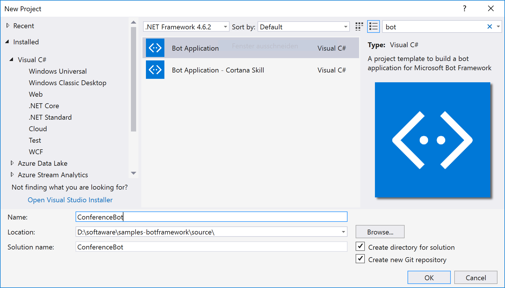
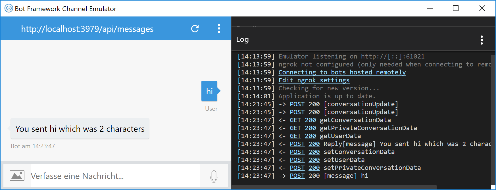

# Installation

## Download
* Das Bot-Framework wird als **NuGet-Package** ausgeliefert
* Für Visual Studio sind **Project Templates** verfügbar:
  * Download unter [Bot Framework SDK and tools](https://docs.microsoft.com/en-us/bot-framework/resources-tools-downloads)
  * ZIP-Dateien kopieren nach _%userprofile%\documents\Visual Studio 2017\Templates\ProjectTemplates\Visual C#_
* Zum Testen ist der **Bot Framework Channel Emulator** praktisch:
  * Download unter [BotFramework-Emulator](https://github.com/Microsoft/BotFramework-Emulator/releases)
  * Setup ausführen

## Neues Projekt
* Erstellen Sie ein neues Projekt mit dem **Bot Application** Template.
* Nennen Sie es **ConferenceBot**



* Updaten Sie ggf. das **Microsoft.Bot.Builder**-NuGet-Package auf die aktuellste Version

## Hello, Bot
Durch das Projekt-Template wird bereits eine minimale Bot-Implementierung bereitgestellt:

Ausschnitt aus *Controllers/MessagesController*
```cs
public async Task<HttpResponseMessage> Post([FromBody]Activity activity)
{
    if (activity.Type == ActivityTypes.Message)
    {
        await Conversation.SendAsync(activity, () => new Dialogs.RootDialog());
    }
    else
    {
        HandleSystemMessage(activity);
    }
    var response = Request.CreateResponse(HttpStatusCode.OK);
    return response;
}
```

Ausschnitt aus *Dialogs/RootDialog*
```cs
[Serializable]
public class RootDialog : IDialog<object>
{
    public Task StartAsync(IDialogContext context)
    {
        context.Wait(MessageReceivedAsync);

        return Task.CompletedTask;
    }

    private async Task MessageReceivedAsync(IDialogContext context, IAwaitable<object> result)
    {
        var activity = await result as Activity;

        // calculate something for us to return
        int length = (activity.Text ?? string.Empty).Length;

        // return our reply to the user
        await context.PostAsync($"You sent {activity.Text} which was {length} characters");

        context.Wait(MessageReceivedAsync);
    }
}
```

### Ausführen des Bots
* Starten Sie die Anwendung
* Kopieren Sie die Adresse (zB http://localhost:3979/)
* Starten Sie den **Bot Framework Channel Emulator**
* Fügen Sie die Adresse inkl. */api/messages* als Endpoint URL ein
* Der Chat kann beginnen!



