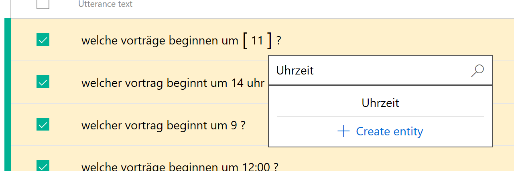
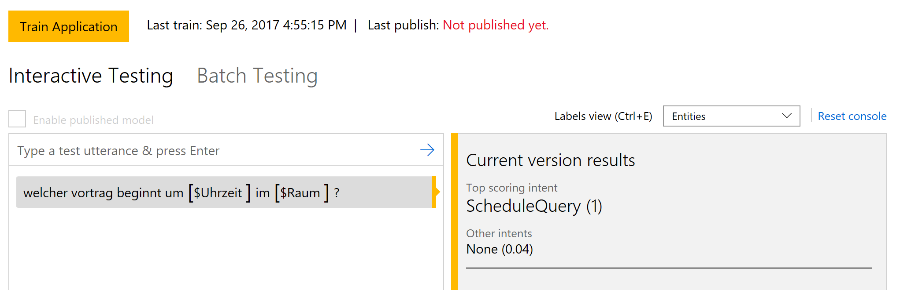
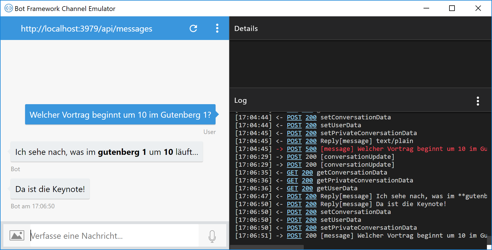

#LUIS - Language Understanding Intelligent Service

## Anmeldung
* Anmeldung unter [luis.ai](https://www.luis.ai)

## LUIS
* Erstellen Sie eine neue App namens **ConferenceApp**, wählen Sie **Deutsch** als Sprache aus
* Erstellen Sie einen Intent **ScheduleQuery**
* Fügen Sie mehrere **Utterances** (Beispielsätze) hinzu und definieren Sie die Entities **Raum** und **Uhrzeit**



* Klicken Sie auf **Train & Test**, **Train application**
* Publishen Sie das LUIS-Service



## LuisConferenceDialog
* Erstellen Sie eine neue Klasse ```Dialogs/LuisConferenceDialog```
* Die Parameter für das Attribut ```[LuisModel]``` finden Sie auf luis.ai unter *Settings* (Application ID = modelId) bzw. *My keys* (Endpoint Key = subscriptionId)

```cs
[LuisModel("8ab12548-3dc5-4456-86b1-2b726d3abaf6", "67b3432988354c6d90ab346d4554a104")]
[Serializable]
public class LuisConferenceDialog : LuisDialog<ScheduleQuery>
{
    [LuisIntent("None")]
    public async Task None(IDialogContext context, LuisResult result)
    {
        string message = $"Tut mir leid, das habe ich nicht verstanden: "
            + string.Join(", ", result.Intents.Select(i => i.Intent));

        await context.PostAsync(message);
        context.Wait(MessageReceived);
    }

    [LuisIntent("ScheduleQuery")]
    public async Task GetSessionInfo(IDialogContext context, LuisResult result)
    {
        var room = result.Entities.FirstOrDefault(p => p.Type == "Raum");
        var time = result.Entities.FirstOrDefault(p => p.Type == "Uhrzeit");

        await context.PostAsync($"Ich sehe nach, was im **{room.Entity}** um **{time.Entity}** läuft...");

        await Task.Delay(1000);

        await context.PostAsync($"Da ist die Keynote!");

        context.Wait(MessageReceived);
    }
}
```

Rufen Sie den ```LuisConferenceDialog``` nun auch im ```MessagesController``` auf.

```cs
await Conversation.SendAsync(activity, () => new Dialogs.LuisConferenceDialog());
```



