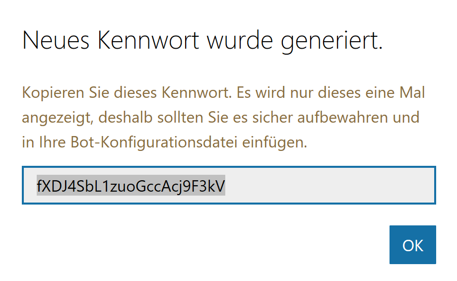

# Veröffentlichung

## Registrierung
* Registrieren Sie sich unter (https://dev.botframework.com)
* Klicken Sie auf **Create a bot**
* Klicken Sie auf **Create**
* Klicken Sie auf **Register an existing bot built using Bot Builder SDK**
* Füllen Sie die benötigten Felder aus und **generieren Sie einen App Key und ein App Secret**


* Kopieren Sie diese Werte in die app.config-Datei

```xml
<appSettings>
    <add key="BotId" value="BastaConfDemo" />
    <add key="MicrosoftAppId" value="92dfd44d-9f63-405f-a7bf-d92daacf985c" />
    <!-- ... -->    
</appSettings>
```

* Klicken Sie auf **Zum Fortfahren App Secret generieren**
* Kopieren Sie das App-Secret ebenfalls in die app.config



```xml
<appSettings>
    <!-- ... -->
    <add key="MicrosoftAppPassword" value="fXDJ4SbL1zuoGccAcj9F3kV" />
</appSettings>
```

* Klicken Sie auf **Abschließen**

## Publish
* Publishen Sie Ihren Bot nun, zB als Azure Web App
* Tragen Sie die Endpunkt-URL in der Bot-Registrierung ein, Achten Sie auf die Angabe von **https** und den korrekten Pfad zu **/api/messages**!
* Klicken Sie abschließend auf **Register**

 

## Testen

Wenn alles geklappt hat, können Sie im Web-Portal den Bot direkt testen:

